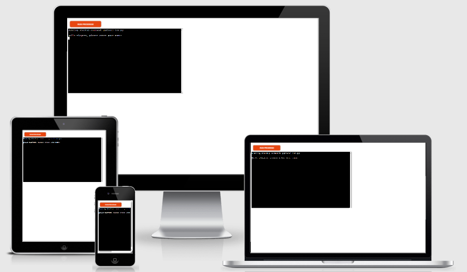
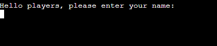
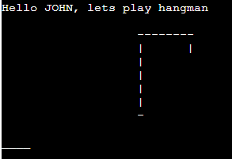
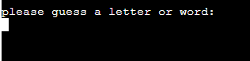
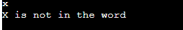
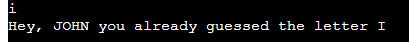
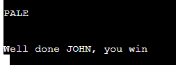
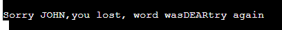

# Hangman

* Hangman gamme is a Python terminal game

* Users can try to find a correct word in 6 steps to win a game.

* Otherwise they will get hanged and lose.

## Here is a version of the game

# How to play the game

* hangman is a classic game played from the youngest age especiall at elementary school, game improves vocabulary mastery

* In this version, playes enters their name

* The playes can see the game(displayed hangman and a line where he can guess the letter in a word which is uknown and randomly generated from the list of words)

# Features

## Existing Features
* words are randomly generated from the list of words

* player name is used thru entire game

* counts number of left tries

* player must enter letters from alphabet

* player is informed of wrongly guessed letter

* player is informed when he guessed the same letter again

* player is informed when the gamme is won

* player is informed when the game is lost

# Data model

There is a word_list of 50 words in a separate file words.py from which random words are generated.
Another separate file game.py holds hangman steps which is a list.png

## Testing

I manually tested the game by doing following
* I gave invalid inputs like numbers
* I tested the game in heroku app

## Bugs

* displaying a word "players" instead of "player" in a welcoming sentence
* displaying words without a space when the game was lost

## Remaining bugs

* none

# Deployment

project was deplpoyed thru heroku app
* heroku app is set to automatic pull from github
* click on Deployment button in a dashboard
* set the buildbbacks python amd node.js in that order
* click Deploy

# Credits
codeinstitute for lessons and help with Deployment
codecademy for extra lessons in functions and manupulating lists
my mentor simen for his knowledge and experience as always